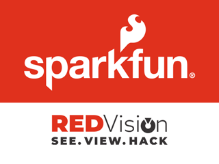

<p align="center">
    
</p>

# SparkFun Red Vision

Welcome to SparkFun's Red Vision package! It contains MicroPython [drivers](red_vision) for SparkFun Red Vision products, and [examples](red_vision_examples) demonstrating how to use those drivers in conjunction with [our MicroPython port of OpenCV](https://github.com/sparkfun/micropython-opencv).

# Quick Start

1. Flash Red Vision MicroPython firmware to your board
    * Back up any files you want to keep, they *will* be overwritten!
    * Download the latest Red Vision firmware for your board from the [Releases tab of our MicroPython fork](https://github.com/sparkfun/micropython/releases) (`RED_VISION_MICROPYTHON_xyz`) and flash it to your board.
        * If you don't know how to flash firmware to your board, find your board [here](https://micropython.org/download/) and follow the instructions using the OpenCV firmware.
2. Configure driver initialization
    * After first boot, the [`red_vision_examples`](red_vision_examples) directory will be automatically extraced to the MicroPython filesystem for easy access to all the examples.
        * You can safely edit these examples, and they will not be overwritten. If you want to restore the examples, delete the `restore_examples.txt` file and reboot your board.
    * Inside that directory, an example module called [`rv_init`](red_vision_examples/rv_init/) is imported by all examples to initialize the drivers. You will likely need to edit the files for your specific hardware and board configuration.
3. Write and run OpenCV code
    * Any IDE should work, so use your favorite!
    * Start with the examples! Go through them in order, which will verify your hardware is working and demonstrate some basics of OpenCV.
    * See [our MicroPython port of OpenCV](https://github.com/sparkfun/micropython-opencv) for more information about how to use it.

# Hardware Support

Hardware support in this repository is mostly limited to SparkFun Red Vision products. We may consider pull requests that add support for additional hardware, see [#Contributing](#Contributing).

Below is the list of currently supported hardware. It's currently very small, but may be expanded in the future.

## MicroPython Devices

| Status | Device | Notes |
| --- | --- | --- |
| ✔️ | [XRP Controller](https://www.sparkfun.com/sparkfun-experiential-robotics-platform-xrp-controller.html) | |

## Camera Drivers

| Status | Device | Notes |
| --- | --- | --- |
| ✔️ | HM01B0 | |
| ⚠️ | [OV5640](https://www.sparkfun.com/ov5640-camera-board-5-megapixel-2592x1944-fisheye-lens.html) | See [#1](https://github.com/sparkfun/red_vision/issues/1) |

## Display Drivers

| Status | Device | Notes |
| --- | --- | --- |
| ✔️ | ST7789 | |

## Touch Screen Drivers

| Status | Device | Notes |
| --- | --- | --- |
| ✔️ | CST816 | |

# Performance

See the [MicroPython-OpenCV READMA](https://github.com/sparkfun/micropython-opencv) general information about performance with OpenCV. For reference, the XRP (with Raspberry Pi RP2350) can run the [SparkFun Logo Detection Example](red_vision_examples/ex06_detect_sfe_logo.py) at 2 to 2.5 FPS at 320x240 resolution.

One way to improve performance is to select the best hardware drivers for your setup. For example, the default SPI driver for the ST7789 is limited to the max SPI baudrate for the processor's SPI peripheral. That's 24MHz in the case of the RP2350, but another driver is provided that uses the PIO peripheral that runs at 75MHz, so displaying images can be ~3x faster (not including required colorspace conversions).

For users wanting maximum performance, it may be desireable to bypass the high-level functions of the display/camera drivers, and instead work directly with the buffer member variables and read/write functions. This can avoid computationally expensive colorspace conversions when reading and writing images if they're not needed, but this is for advanced users only.

# Installing Red Vision with `mip`

If you want to add the Red Vision package to a board that's already running MicroPython, you can easily install it using `mip`:

```
mip install github:sparkfun/red_vision
```

## Building Red Vision MicroPython Firmware

If you're building MicroPython firmware from scratch and want to freeze Red Vision into your firmware, perform the following:

1. Clone this repo and MicroPython
    * ```
      cd ~
      git clone https://github.com/sparkfun/red_vision.git
      cd red_vision
      git submodule update --init
      cd ~
      git clone https://github.com/micropython/micropython.git
      ```
2. (Optional) Archive the [red_vision_examples](red_vision_examples) folder so it can be frozen into the firmware
    * If you want the examples to be available in the MicroPython filesystem in an editable folder, run the following:
    * ```
      pip install freezefs
      python3 -m freezefs red_vision/red_vision_examples red_vision/extract_red_vision_examples.py  --on-import=extract --compress --overwrite always
      ```
        * This will use [`freezefs`](https://github.com/bixb922/freezefs) to build the examples folder into a compressed and self-extracting archive that can be frozen into the firmware.
        * The benefit of using `freezefs` is that it can extract the contents into a folder that you can easily view and edit, whereas simply freezing the folder with the normal MicroPython manifest system would mean the examples are not editable or viewable.
3. Build Red Vision MicroPython firmware
    * ```
      make -C red_vision PORT_DIR=~/micropython/ports/rp2/ BOARD=SPARKFUN_XRP_CONTROLLER -j4
      ```
    * Replace `rp2` and `SPARKFUN_XRP_CONTROLLER` with your platform and board name respectively
    * The [`Makefile`](Makefile) does a few things:
        * It sets `BOARD_VARIANT` to `RED_VISION`. That variant must be created if it hasn't been already.
        * It sets `USER_C_MODULES` to [`micropython-opencv`](micropython-opencv) so OpenCV is built into the firmware.
        * It sets `FROZEN_MANIFEST` to the Red Vision [`manifest.py`](manifest.py), which does a few things:
            * It retains your board's original manifest file, so all modules that are normally frozen for your board are still included.
            * It freezes the [`red_vision`](red_vision) directory as a module that can be imported.
            * It also includes the [`sdcard`](https://github.com/micropython/micropython-lib/tree/master/micropython/drivers/storage/sdcard) module, which is not normally included in MicroPython, but is very useful if you're working with images.
            * If the examples folder was archived, it will be included. It will additionally freeze the [`boot.py`](boot.py) file into the firmware, which will automatically unpack the examples if needed.

# Contributing

Found a bug? Want support for other hardware?

First, please see if there is an [existing issue](https://github.com/sparkfun/micropython-opencv/issues). If not, then please [open a new issue](https://github.com/sparkfun/micropython-opencv/issues/new) so we can discuss the topic!

Pull requests are welcome! Please keep the scope of your pull request focused (make separate ones if needed), and keep file changes limited to the scope of your pull request.

Keep in mind that we only intend to support SparkFun Red Vision products in this repository, though we may be open to hosting support for some hardware from other vendors. Please first open an issue to check if we're open to it.
